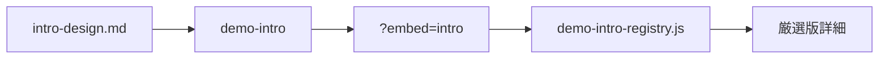

# 紹介アニメ横展開 PLAN（未作成7件）

作成日：2026-09-22  
前提：厳選版詳細への埋め込み方式は **iframe + 外部 `?embed=intro`**（[詳細ページ紹介アニメ PLAN](../../.cursor/plans/) Phase 1 済み）。  
正本エンジン：[`internal_knowledge_demo/src/components/demo-intro/`](../../../internal_knowledge_demo/src/components/demo-intro/)  
設計：[`docs/demo-intro-design.md`](../../../docs/demo-intro-design.md)  
手順：[`docs/demo-intro-playbook.md`](../../../docs/demo-intro-playbook.md)

---

## 1. 完成済み（Phase 1）

| ID | 外部 | embed URL |
|---|---|---|
| `internal-knowledge` | `internal_knowledge_demo` | `/?embed=intro&from=axeon-demo-selection` |
| `quality-incident` | `axeon_manufacturing02` | 同上 |
| `construction-record` | `construction_demo` | 同上 |
| `kaigo-handoff` | `kaigo_handoff_demo` | 同上（**詳細のみ**。デモ本体トップには出さない） |
| `logistics-dispatch` | `driver_dash_demo` | 同上（**詳細のみ**） |

厳選版側の登録先：[`src/demo-intro-registry.js`](../src/demo-intro-registry.js)。ここに1件足すと詳細ページの hero と「代表3手」の間に自動表示される。

---

## 2. 未作成5件

| 順 | ID | 本体 | 代表3手（設計の起点） | 推奨型 |
|---|---|---|---|---|
| 3 | `wholesale-quote` | `wholesale_quote_demo` | 問い合わせ → 在庫表 → 人が返す | B |
| 4 | `approval-inspection` | `Approval_diagram` | 照合 → 保留 → 承認 | B / C |
| 5 | `gym-facility` | `disaster_prevention_demo02` | 施設状況 → カルテ → 画像確認 | B |
| 6 | `field-dandori` | `denkigenba_dandori_demo` | 依頼一覧 → 段取り案 → 申請準備 | B |
| 7 | `dd-ma` | `dd_demo` | EXIT → 主軸切替 → 問いと時間 | B |

着手順は依存・難易度の近い順（上から）。**1デモ・1フェーズ**で進める。

---

## 3. 1件あたりの作業手順

1. **設計メモ** — `docs/impl/<id>-intro-design.md` に4問・型・場面表を書く。秒数・場面数は社内ナレッジに合わせない。
2. **エンジン移植** — 外部デモに `components/demo-intro/`（または vanilla なら `src/demo-intro/`）を置く。`story` と `screens` だけデモ固有に書き直す。
3. **トップ配置** — 新規は置かない。詳細ページの iframe のみ。
4. **`?embed=intro`** — LP ヒーロー・CTA・フッターなしで紹介だけ返す。背景は intro のダークトーン。
5. **レジストリ** — [`demo-intro-registry.js`](../src/demo-intro-registry.js) に `src` / `title` / `height` を追加。
6. **確認** — 厳選版 `?demo=<id>` で 390 / 1440。一時停止・最初から・reduced-motion。詳細を閉じると iframe が止まること。

---

## 4. やらないこと

- mp4 動画化
- `axeon_demo_selection` 内へのエンジン二重移植
- 代表3手スクリーンショット（`01–03.jpg`）の差し替えを紹介作成と同時にやる
- 外部デモ CTA の深リンク復活（トップから始める方針を維持）

---

## 5. 受け入れ（1件）

- 新規は外部トップに紹介を置かない（`/?embed=intro` のみ）
- `/?embed=intro` で紹介だけが表示される
- 厳選版詳細に iframe が出て、停止・字幕・場面進行が動く
- 他デモの紹介・レジストリを壊していない
