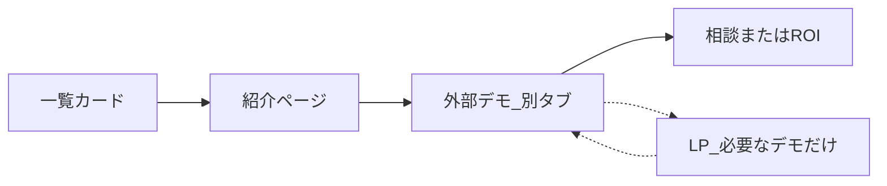

# 厳選10件 完成までの大枠PLAN

作成日：2026-09-20  
状態：正本。コード改修はこの文書だけでは行わない。  
選定の確定：[phase3-selection-draft.md](phase3-selection-draft.md)  
複製・公開の工程：[厳選版の複製・公開・選定PLAN.md](厳選版の複製・公開・選定PLAN.md)

この文書は **10件の「カード → 紹介ページ → 外部デモ →（必要なものだけLP）→ 相談」をどう通すか** だけを持つ。`ideal_pf` は触らない。

---

## 1. 使い方

- 完成までの基本。チャットで「建設の実装PLAN」などと言ったら、まずこの文書を読む。
- 1デモ分の具体PLANを別途作り、実装する。1メッセージで全10件を実装しない。
- デモ本体の磨きは [demo-ux-brushup-playbook.md](demo-ux-brushup-playbook.md) どおり **1デモ・1フェーズ**。ロードマップ（`docs/executive-ux-roadmap.md`）が無ければ UX-0 のみ。
- 個別PLANの置き場：`docs/impl/<id>-plan.md`（例：`docs/impl/construction-record-plan.md`）。着手時に作る。
- 1件が流れ完成したら、下の進捗表を更新する。

---

## 2. 完成の定義（1件）

次が揃ったらその1件は「流れ完成」。カードに出すのはこの後。準備中・未納品のものはカードに出さない。



| 層 | 完成の中身 |
|---|---|
| 一覧 | 見出しだけで選べる。準備中は出さない |
| 紹介 | 誰の仕事か／何が起きるか（代表3手）／短い体験条件／外部デモCTA。悩み・検討理由の長文は置かない |
| デモ | 納品画面に見える。代表3手が完走。説明で止めない。別タブ。カードへ戻る導線は付けられるものから |
| LP | 名簿で「作らない」は作らない。「候補」はデモ完走後に要否を決める。付けるならデモへ戻れる |

入口は複数あってよい（一覧、紹介の共有URL、デモ直リンク、LP直リンク）。同じ人が歩き通したときに、同じ説明を繰り返さない。層の役割の詳細は [phase3-selection-draft.md](phase3-selection-draft.md)。

### サイト側の共通土台（波0で一度だけ）

各デモの個別PLANにサイト全体の再設計を入れない。波0で次を決める。

- カードを確定名簿＋公開可だけに制限する
- 全件一覧・業種検索を厳選版から外す
- 関連デモを確定10件の範囲にする
- 外部デモからの戻り先URL（カード一覧、必要なら該当詳細）の決め方

掲載データの入口は [`src/data.js`](../src/data.js) の `listed` / `featuredOrder`。紹介ページは [`src/demo-story.js`](../src/demo-story.js)。建設だけ [`src/construction-story.js`](../src/construction-story.js) が厚い。

---

## 3. 確定10件

カード順は代表を先頭にし、同じ業界が続かないようにする。卸・運送・DDは体験が納品線に届いてからカード化。

| 順 | 名前 | ID | 本体パス | LP | 個別PLAN | 流れ完成 |
|---|---|---|---|---|---|---|
| 1 | 建設 | `construction-record` | `construction_demo` | 作らない | [ ] `docs/impl/construction-record-plan.md` | [x] |
| 2 | 社内ボット | `internal-knowledge` | `internal_knowledge_demo` | 別LP原則なし | [x] `docs/impl/internal-knowledge-plan.md` | [x] |
| 3 | 製造 | `quality-incident` | `axeon_manufacturing02` | 完走後に判断 | [x] `docs/impl/quality-incident-plan.md` | [x] |
| 4 | 運送 | `logistics-dispatch` | `driver_dash_demo` | `/lp`（体験 `/board` のあと） | [x] `docs/impl/logistics-dispatch-plan.md` | [x] |
| 5 | 受け入れ | `approval-inspection` | `Approval_diagram` | 完走後に判断 | [x] `docs/impl/approval-inspection-plan.md` | [x] |
| 6 | 介護 | `kaigo-handoff` | `kaigo_handoff_demo` | 原則なし | [x] `docs/impl/kaigo-handoff-plan.md` | [x] |
| 7 | 電気工事の段取り | `field-dandori` | 現行URLの段取りデモ | 原則なし | [ ] `docs/impl/field-dandori-plan.md` | [ ] |
| 8 | 施設管理 | `gym-facility` | `disaster_prevention_demo02` | 完走後に判断 | [x] `docs/impl/gym-facility-plan.md` | [x] |
| 9 | DD | `dd-ma` | `dd_demo` | 候補 | [x] `docs/impl/dd-ma-plan.md` | [x] |
| 10 | 卸 | `wholesale-quote`（未登録） | 未作成 | 完走後に判断 | [ ] `docs/impl/wholesale-quote-plan.md` | [ ] |

補足：

- 建設は代表。トップ先頭。ハブ＋3体験あり。
- 施設は `gym-facility`（指定管理）。`disaster-facility` は厳選版に出さない。
- 卸は `data.js` 未登録。カード化は納品後。運送（`logistics-dispatch`）・DD（`dd-ma`）は登録済み・流れ完成。
- 卸は体験版ができるまでカードに出さない。

---

## 4. 波（順番は変えない）

| 波 | 対象 | 内容 | 状態 |
|---|---|---|---|
| 0 | 厳選版サイト | 掲載フィルタ、全件一覧の扱い、関連範囲、戻り先URLの決め方 | [ ] |
| 1 | 建設 | 紹介を3ステップ＋開始に削る。デモの納品UI点検。戻り導線の試作。LPなし | [x] |
| 1 | 社内ボット | 紹介ページを薄くする。デモ内の重複説明を削る | [x] |
| 2 | 介護 → 段取り → 施設 → 製造 → 受け入れ | 既存を1本ずつ納品UIまで。製造と受け入れは同時に触らない | [ ] |
| 3 | 運送、DD | 未掲載資産を納品UIにしてからカード追加。DDのLP要否 | [x] DD・運送とも流れ完成 |
| 4 | 卸 | 新規。他の納品を止めない | [ ] |

波1の建設が「紹介 → デモ → 相談」まで通ってから、厳選版サイトの本格差し替え（カード数の制限など）を進める。名簿確定だけで全カードを一度に差し替えない。最初の公開カードは建設＋社内ボットでもよい。

---

## 5. 各層の作業チェック（1件ごと）

個別PLANの完了時に、該当IDについて確認する。

### 一覧カード

- [ ] 確定名簿にあり、公開可であるものだけ出している
- [ ] 見出しで業種と仕事が分かる
- [ ] 説明文を増やしていない

### 紹介ページ

- [ ] ヒーロー：名前、対象者、短い約束、外部デモへの主CTA
- [ ] 何が起きるか（代表3手まで）。建設は分類・命名／下書き／管理画面
- [ ] 体験条件がCTA近くに短い
- [ ] 悩み・検討理由・「自社への問い」の長文を置いていない
- [ ] 関連は確定10件の範囲だけ

### 外部デモ

- [ ] 納品物に見える画面。設定・ROI・技術語はデフォルトに出していない
- [ ] フロントは通過用。説明で止めていない
- [ ] 代表3手が詰まらず完走できる
- [ ] 別タブ。カード一覧へ戻る手段を、実装できるものから付けた（または今回の範囲外と明記）

### LP（付けるデモだけ）

- [ ] 名簿が「作らない」なら作っていない
- [ ] 操作手順を書いていない
- [ ] デモへ戻るリンクがある

---

## 6. 個別実装PLANのテンプレ

着手時に `docs/impl/<id>-plan.md` を作り、次の見出しを埋める。デモ本体を触るとき、そのリポジトリに `docs/executive-ux-roadmap.md` が無ければ、中身は UX-0（計画のみ・コード変更なし）に相当するものだけにする。

```text
# <名前>（<id>）実装PLAN

作成日：
波：0 / 1 / 2 / 3 / 4
対象ID：
本体パス：
参照：docs/selection-completion-plan.md

## 今回の範囲（1つに絞る。混ぜすぎない）

- [ ] 紹介ページ
- [ ] デモ本体（UX-n。番号を書く）
- [ ] 戻り導線
- [ ] LP
- [ ] カード公開

## 3分後に言えること

「……」

## 代表3手

1.
2.
3.

## やること

-

## 受け入れ（画面で Yes/No）

- [ ]
- [ ]
- [ ]

## やらないこと

- 他デモの改修
- ideal_pf の変更
- スコープ外の機能追加
- （その他）

## 完了後

- [ ] selection-completion-plan.md の進捗表（個別PLAN・流れ完成・波）を更新する
```

---

## 7. 関連文書

| 文書 | 役割 |
|---|---|
| [phase3-selection-draft.md](phase3-selection-draft.md) | 掲載10件と層の役割の確定 |
| [厳選版の複製・公開・選定PLAN.md](厳選版の複製・公開・選定PLAN.md) | 複製・デプロイ・名刺までの工程 |
| [demo-ux-brushup-playbook.md](demo-ux-brushup-playbook.md) | デモ本体の1フェーズ磨き |
| `docs/impl/<id>-plan.md` | 都度作る個別実装PLAN |

---

## 8. 次に行う作業

1. 波0：厳選版サイトの掲載フィルタと戻り先の決め方（設計。必要なら短い実装PLAN）
2. 波2：介護 → 段取り → 施設 → 製造 → 受け入れ（1本ずつ）

波1（建設・社内ボット）の流れ完成は 2026-09-21 時点で完了。
